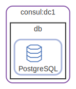

# consul

  [ <a href="../../ndiag.descriptions/_layer-consul.md">:pencil2: Edit description</a> ]

## consul:dc1

  [ <a href="../../ndiag.descriptions/_cluster-consul_dc1.md">:pencil2: Edit description</a> ]

### Nodes

| Name | Description |
| --- | --- |
| [db](node-db.md) | <a href="../../ndiag.descriptions/_node-db.md">:pencil2:</a> |

---

> Generated by [ndiag](https://github.com/k1LoW/ndiag)
