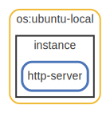

# os

  [ <a href="../../ndiag.descriptions/_layer-os.md">:pencil2: Edit description</a> ]

## os:ubuntu-local

  [ <a href="../../ndiag.descriptions/_cluster-os_ubuntu-local.md">:pencil2: Edit description</a> ]

### Nodes

| Name | Description |
| --- | --- |
| [instance](node-instance.md) | <a href="../../ndiag.descriptions/_node-instance.md">:pencil2:</a> |

---

> Generated by [ndiag](https://github.com/k1LoW/ndiag)
