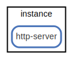

# instance

  [ <a href="../../ndiag.descriptions/_node-instance.md">:pencil2: Edit description</a> ]

## Components

| Name | Description | From (Relation) | To (Relation) |
| --- | --- | --- | --- |
| instance:http-server |  <a href="../../ndiag.descriptions/_component-instance_http-server.md">:pencil2:</a> |  |  |

## Labels

| Name | Description |
| --- | --- |

---

> Generated by [ndiag](https://github.com/k1LoW/ndiag)
